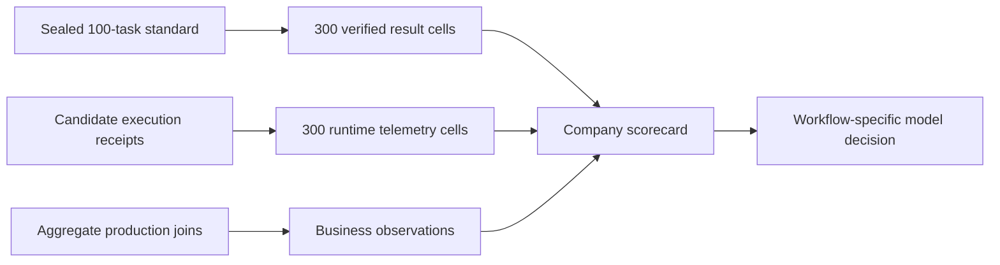

# Understanding AIVideo Bench as a company decision system

This explainer is the understanding gate for the company-scorecard change. It
describes the decisions the system supports, how evidence flows through it, why
the implementation keeps several metrics separate, and what remains unproven.

## 1. The intuition

An agent can be good in one sense and bad in another:

- it can produce a beautiful result but take twelve minutes;
- it can finish quickly while silently damaging unrelated project work;
- it can be cheap per attempt but expensive per *usable* result;
- it can score well in a sealed benchmark without causing retention or revenue;
- it can use a tool correctly while the underlying media provider fails.

Those are different facts. Compressing them into one weighted number hides the
reason a candidate won and makes the result easy to manipulate. AIVideo Bench
therefore keeps three evidence planes separate:

1. **Capability:** can the agent produce the verified result?
2. **Operations:** how quickly, cheaply, safely, and efficiently does it work?
3. **Business:** what happens to real users and the company after deployment?

The selection decision happens at the end, for a particular workflow and its
constraints. The benchmark does not manufacture a universal winner.

## 2. Concrete examples

### Example A: cheap attempts, expensive successes

Candidate A costs `$0.03` per trial and succeeds operationally on 20% of trials.
Candidate B costs `$0.08` per trial and succeeds on 80%.

For 100 trials:

- A costs `$3.00`, produces 20 usable results, and costs `$0.15` per success;
- B costs `$8.00`, produces 80 usable results, and costs `$0.10` per success.

Raw request price would select A. Cost per operational success selects B. The
scorecard reports both instead of choosing the convenient denominator.

### Example B: model failure versus dependency failure

If the agent sends invalid arguments to `place_clips`, that is agent/tool-use
evidence. If it sends valid arguments and an external media service returns an
error, that is dependency evidence. Both affect the product experience, but
they point to different owners and fixes. The report keeps both visible.

### Example C: benchmark quality versus business impact

A model may improve from `46/100` to `61/100` while paid-user retention remains
unmeasured. The correct statement is “verified benchmark quality improved.” It
is not “the model improved retention.” Retention appears only when a defined
production cohort or experiment supplies a numerator, denominator, and window.

## 3. Evidence flow



Every standard candidate comparison uses the same task registry, three trials
per task, tool-surface identity, and verifier policy. A registered tool-ablation
pair may intentionally change only its sealed pack/tool surface. Missing cells
invalidate either matrix rather than being averaged away.

## 4. Behavior-ordered walkthrough

### Step 1: the candidate runs a sealed task

`candidate_execution.py` already bounded OpenRouter inference, allowed only the
sealed AIVideo MCP tools, enforced the assigned project, and recorded exact
cost. The v2 receipt now also measures:

- first model response, total inference time, and total MCP time;
- input, cached-input, reasoning, and output tokens;
- tool attempts, dispatched calls, successes, errors, invalid arguments, and
  later same-tool successes following errors.

These measurements are collected during execution. No LLM judge estimates
latency, cost, tokens, or whether a tool returned an error.

### Step 2: the independent verifier supplies judgments

Some facts cannot be derived honestly from the transport receipt. The verifier
adds explicit annotations for:

- redundant tool calls;
- false completion;
- destructive side effects;
- context-limit and stuck-loop incidents;
- human intervention;
- external dependency failure.

`run_row_from_receipt` requires a complete annotation record, verifier-policy
version, and evidence hash for every cell. It rejects unknown redundancy tool
names. The distinction prevents missing review or a heuristic from quietly
becoming ground truth.

### Step 3: the complete matrices are validated

`summarize_results` continues to validate the canonical 300 quality cells.
`summarize_company_candidate` separately validates 300 runtime cells. It
rejects:

- missing, extra, or duplicate task/trial cells;
- inconsistent tool accounting;
- impossible timing or token relationships;
- runtime statuses or incident annotations that contradict scored success,
  execution validity, or cost-cap state;
- unsupported business metrics, sources, or claim levels;
- business values that do not match their numerator and denominator.

An owner-authenticated HMAC run manifest binds the result, runtime, and
result-to-receipt binding hashes to the exact candidate configuration, pack,
MCP surface, prompt policy, verifier policy, calibration evidence, and standard.
Model/provider labels are derived from the canonical candidate configuration
rather than supplied independently. Each runtime cell also carries its receipt
hash, measured cost/cap/media fields, and those
execution identities. A complete binding matrix requires the corresponding
quality and runtime cell to name the same receipt, preventing quality from one
run being combined with telemetry from another. The company layer does not
change the 100-point scoring contract.

### Step 4: operational metrics are computed

The aggregator derives:

- end-to-end mean, p50, and p95 latency;
- first-response p50 and inference-versus-MCP time;
- total and per-trial inference cost;
- cost per operational success;
- decomposed token totals;
- global and per-tool success, argument, redundancy, and
  same-tool-success-after-error rates;
- incident and human-intervention rates.

External dependency failures remain a separate field. They are not erased just
because the model behaved correctly.

### Step 5: business evidence is admitted

The business registry contains stable metric IDs, labels, decision questions,
units, directions, and expected sources. Adding a sibling business metric is a
single registry entry; the validator and report render it automatically.

Each observation includes:

- value;
- numerator and denominator;
- exact window;
- source category;
- claim level: `observed`, `directional`, or `causal`.

Observed claims require cohort/query identity. Directional claims additionally
require a comparator numerator, denominator, window, and query identity. Causal
claims require experiment identity, assignment unit, control counts, and an
analysis-policy version, authenticated analysis artifact, control exposure,
and effect confidence interval. All business evidence is bound to the candidate
configuration identity. Missing metrics render as `not measured`, never zero.

### Step 6: the report is rendered

`company-report` accepts one or more complete candidate JSON files and emits
Markdown or JSON. The Markdown starts with the executive comparison, then shows
definitions, speed and inference economics, incidents, tool performance, and
all registered business questions.

The CLI refuses to create an overall composite or automatic winner. It renders
an official score only when execution validity, verifier provenance, cost
preflight and measured cap, zero paid-media use, and the authenticated
calibration gate all pass. A task blocked by cost preflight spends zero dollars
but still fails the official economic gate.

## 5. Architecture decisions

### Chosen: three explicit evidence planes

This preserves causal and operational meaning. A business owner can set a
workflow-specific constraint such as “quality at least 55, p95 under 90 seconds,
no destructive incidents, then lowest cost per success.”

### Chosen: one business-metric registry

Business metrics are the demonstrated horizontal extension axis. A registry
makes each addition a bounded data change while keeping validation and rendering
centralized.

### Chosen: measured receipts plus explicit annotations

Transport facts and verifier judgments have different provenance. Keeping the
join explicit makes disagreements auditable.

### Chosen: authenticated variants and ablation groups

Each compared configuration has a unique variant ID. A same-model MCP ablation
uses one standard and one tool-ablation variant in the same authenticated group.
They must share candidate configuration, task-pack identity, prompt/verifier
policies, calibration evidence, and task cells; only the sealed pack/tool
surface may differ.

### Rejected: one blended company score

A weighted average permits catastrophic safety or reliability failures to be
cancelled by speed or price. It also creates arbitrary debates about weights.

### Rejected: infer business impact from benchmark scores

Sealed tasks test capability. They do not contain the exposure, counterfactual,
or production cohort needed for revenue or retention attribution.

### Rejected: treat missing metrics as zero

Zero is a measurement. Missing means the join or sample does not exist. Mixing
the two would reward candidates with worse observability.

## 6. State transitions and contract boundaries

```text
candidate receipt v2
  -> normalized runtime row
  -> complete 300-cell runtime matrix
  -> candidate operational summary

verified result rows
  -> complete 300-cell quality matrix
  -> official or invalid quality summary

aggregate business observation
  -> registry and denominator validation
  -> explicit claim level

three summaries
  -> company report
  -> human workflow-specific decision
```

The public repository owns schemas, aggregation, and presentation. Private task
prompts, projects, raw runs, customer events, and identifiers remain outside it.

## 7. Risks and remaining uncertainty

- The report is ready, but current Luna, Terra, and Sol comparisons still need
  complete sealed 300-cell runs before any official ranking.
- False completion, redundancy, and destructive behavior depend on independent
  verifier quality; their annotation policy must be calibrated and versioned.
- Production business metrics need durable model/configuration joins. A weak
  join can produce precise-looking but unattributable numbers.
- Provider and media-service incidents affect the user even when separated from
  model failures; model selection alone cannot fix those dependencies.
- A workflow-specific release policy still needs explicit latency, reliability,
  and cost thresholds. The framework intentionally does not guess them.
- Manifest HMAC keys and verifier/calibration evidence must remain in
  access-controlled evaluator infrastructure; the public repository contains
  only their verification contract.

An interactive micro-world was not added because the key relationship is a
three-plane evidence separation, which the small flow diagram and numeric
examples convey without another maintained artifact.

## 8. Comprehension questions

1. Why can the cheaper model per trial be more expensive per operational
   success, and which denominator exposes that?
2. Which fields are measured directly during execution, and which require an
   independent verifier annotation?
3. Why does an external dependency failure remain visible even when it should
   not be attributed to the model?
4. What additional evidence is required before a benchmark-quality improvement
   can be described as a causal retention improvement?
5. If a team adds a new business KPI, which part of the system changes and
   which validation and rendering code should remain unchanged?
